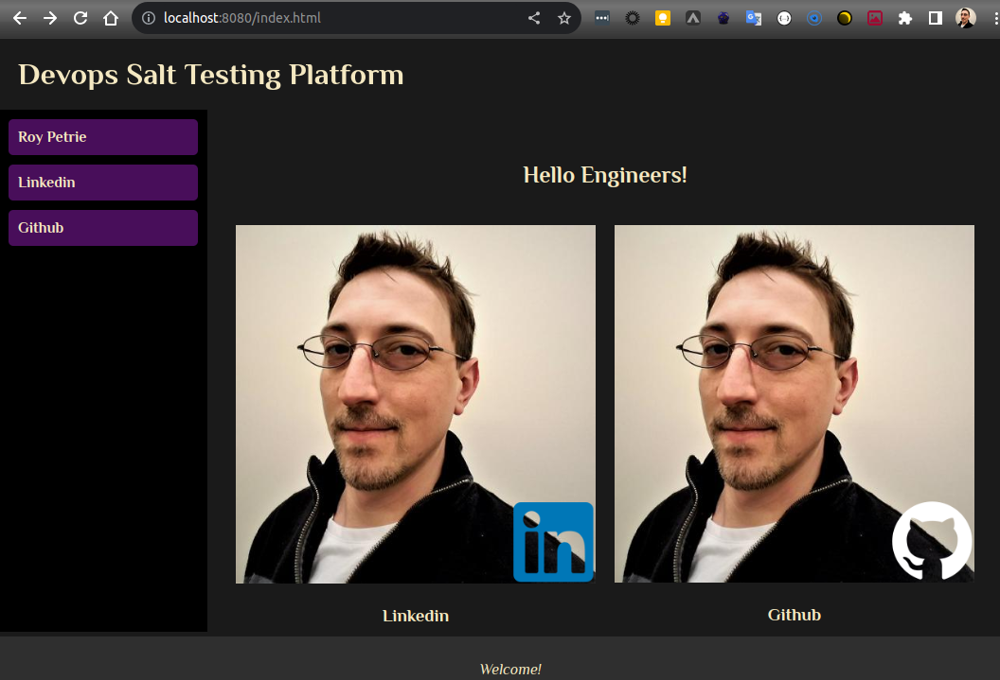
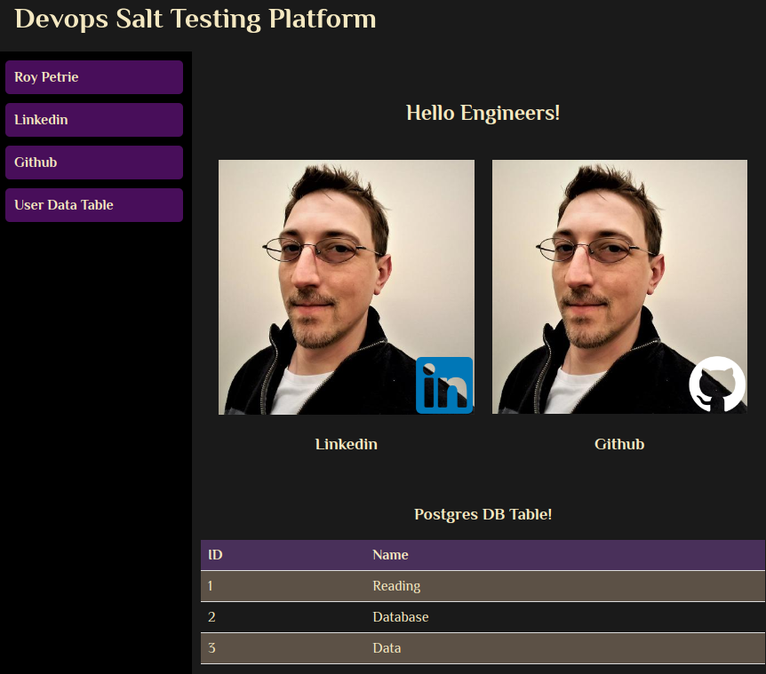

# petrie_salt
Project to learn salt stack

## Prerequisites:

1. **Vagrant:** This is a tool for building and managing virtual machine environments. Ensure you have Vagrant installed.
2. **VirtualBox:** Vagrant uses providers like VirtualBox to manage the virtualization. Ensure you have VirtualBox installed.
3. **Git (optional):** If you want to version control the project or clone it from a repository, ensure you have Git installed.

## Project Structure & Explanation:


```bash
saltstack_project/
.
├── README.md
└── saltstack_project
    ├── cheat_sheet
    │   └── README.md
    ├── clean.sh
    ├── run.sh
    ├── salt
    │   └── webserver
    │       ├── configure_pg_auth.sh
    │       ├── init_pg.sh
    │       ├── init.sls
    │       ├── nginx_default.conf
    │       ├── schema.sql
    │       └── srv
    │           ├── images
    │           │   ├── devops.png
    │           │   ├── preview.png
    │           │   ├── profile_github.png
    │           │   ├── profile_linkedin.png
    │           │   └── profile_pic.jpeg
    │           ├── index.html
    │           ├── index.php
    │           ├── phpinfo.php
    │           ├── script.js
    │           ├── styles.css
    │           └── table.php
    ├── setup_salt_master.sh
    ├── setup_salt_minion.sh
    ├── ubuntu-bionic-18.04-cloudimg-console.log
    └── Vagrantfile

```

## How to Use:

1. Navigate to the `saltstack_project` directory.
2. Run `bash run.sh`. This will run the script that triggers a vagrant deploy reading the `Vagrantfile`, start the necessary virtual machines, and apply the provision scripts (`setup_salt_master.sh` and `setup_salt_minion.sh`).
3. Once `bash run.sh` completes, the web server state as defined in `salt/webserver/init.sls` should be applied to the minion. You can access the web server by navigating to the minion's IP on a web browser.
> This project currently uses `localhost:8080`

_A cleanup script (clean.sh) has been created to remove any lingering parts of the deployment_

---

#### A few Notes:
* Setup has been built and tested on local Ubuntu 22.04
* Network communications depend on virtualbox configurations. This setup uses `192.168` addressing locally to have the virtual machine communicate. Use the following to adjust the configurations on your network:

##### Vagrantfile
> line 15 (master)
```bash
master.vm.provision "shell", inline: <<-SHELL
      MASTER_IP=$(ip addr show | grep 'inet ' | grep '192.168.' | awk '{print $2}' | cut -d'/' -f1)
      echo $MASTER_IP > /vagrant/master_ip.txt
    SHELL
```
**_This line is just to show where it is used for the minion_**
> line 28 (minion)
```bash
minion1.vm.provision "shell", inline: <<-SHELL
      MASTER_IP=$(cat /vagrant/master_ip.txt)
      /vagrant/setup_salt_minion.sh "$MASTER_IP"
    SHELL
```

---

### Expanded Deployment 
> _[ Update: 2023.09.13 ]_
- This deployment was expanded to include a postgres DB with basic information then PHP was used to retrieve the data and display on the `index.php` 
- `index.html` is defaulted first but a `index.php` is also added along with a basic plain `table.php` page to show the data as raw.
 
Additional changes include:
- Replacing the `/etc/nginx/sites-available/default` to include the use of PHP (`nginx_default.conf`)
- Creating a basic postgres script for preparing the DB (`init_pg.sh`)
- Changing pg authentication from peer to MD5 (`configure_pg_auth.sh`)
  - `configure_pg_auth.sh` uses `schema.sql` to prepare database entries
- Additional changes include watching `default` (nginx default config) to restart nginx when changes are made to the file and some service restarts added to the init.sls
-  Some additional configurations were also added for debugging php and postgres failures

---

#### Preview
> **Preview of the Base index.html Page**



---

> **Preview of the Base index.php Page**

